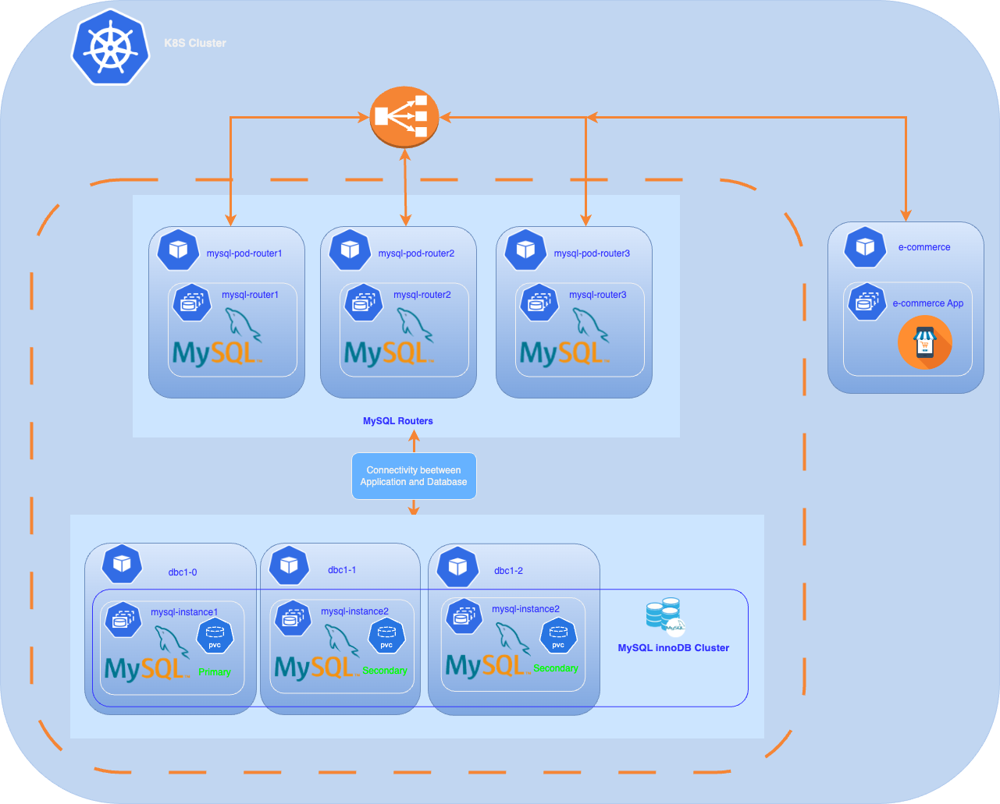
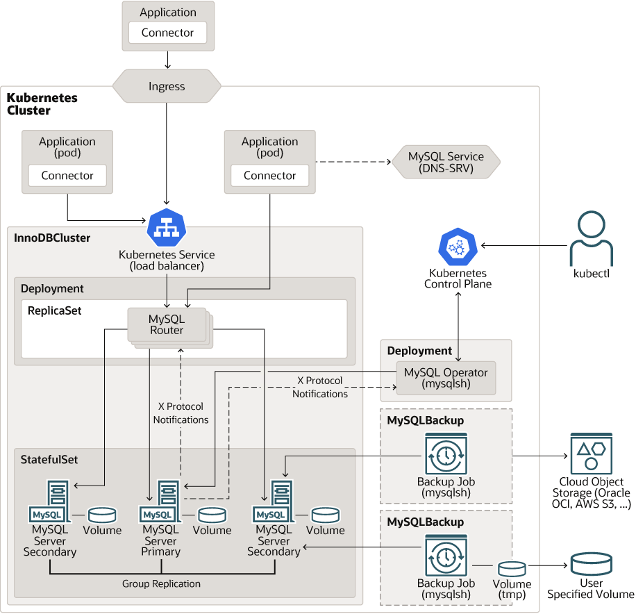
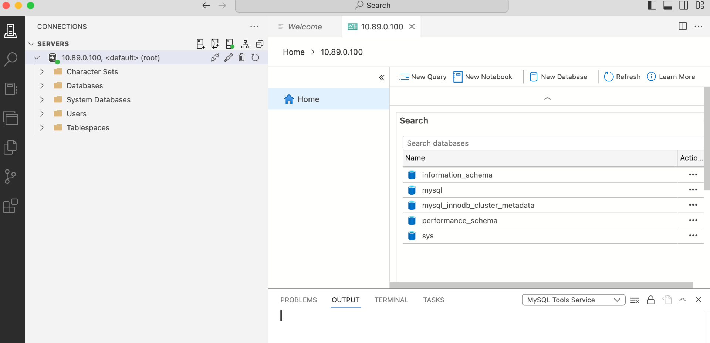

  
## Deploy a MySQL InnoDB Cluster on Kubernetes with MySQL Operator .





Today’s cloud-native applications, the demand for scalable and resilient databases is higher than ever. MySQL, one of the most popular relational database management systems, provides high availability and robust performance through its InnoDB Cluster feature. However, managing MySQL InnoDB Clusters can be complex, especially in dynamic environments like Kubernetes.

Kubernetes has become the standard for orchestrating containerized applications, allowing teams to automate deployment, scaling, and management of applications. To streamline the management of MySQL clusters within Kubernetes, the MySQL Operator offers a powerful solution. An Operator is a method of packaging, deploying, and managing a Kubernetes application, providing the capability to automate complex tasks and improve operational efficiency.

This document will guide you through the deployment process of a MySQL InnoDB Cluster on Kubernetes using the MySQL Operator. By following this guide, you will learn how to set up, configure, and manage your MySQL clusters within a Kubernetes environment, leveraging the benefits of automation to ensure high availability and fault tolerance.





## Prerequisites
Before you get started, you’ll need to have these things:
- An operational Kubernetes cluster.
- Installed kubectl command-line tool.
- A Oracle container registry account .
- bash version 4+
- mysqlshell or mysql client installed

## Create a named secret containing Oracle Cloud Infrastructure credentials

When you install the application using Kubernetes manifes or Helm, use a Kubernetes secret to provide the authentication details to pull an image from the remote repository.

The Kubernetes Secret contains all the login details you provide if you were manually logging in to the remote Docker registry using the docker login command, including your credentials.

Create a secret by providing the credentials on the command-line by using the following command :

ora-cont-secret.yaml:
```yaml
apiVersion: v1
kind: Secret
metadata:
  name: oracle-registry-secret
type: kubernetes.io/dockerconfigjson
data: 
 .dockerconfigjson:XXXXXXXXXXXXX
```


**dockerconfigjson** corresponds to these JSON entries encoded in base64 :

```json
{
    "auths":{
          "container-registry.oracle.com": {   
        "username":"USERNAME",
        "password":"XXXXXXXX",
        "email":"EMAIL"
         }
        }
}

```

- *container-registry.oracle.com:* Name of Oracle container registry.
- *USERNAME:* User name to access the remote Oracle container registry. The format varies based on your Kubernetes platform.
- *PASSWORD:* Password to access the remote Oracle container registry.
- *EMAIL:* Email ID for your Docker registry.

We will encode the JSON string with the following command:

```bash
:> echo -n '{"auths":{"container-registry.oracle.com":{"username":"xxxx","password":"xxxx","email":"xxx@xxx"}}}' | base64

```

You should get something like:

```bash
eyJhdXRocyI6eyJjb250YWluZXItcmVnaXN0cnkub
```

Use the encoded output in your Secret: Then, insert this encoded code into your secret definition. The YAML file should look like this:

```yaml
apiVersion: v1
kind: Secret
metadata:
  name: oracle-registry-secret
type: kubernetes.io/dockerconfigjson
data: 
 .dockerconfigjson: eyJhdXRocyI6eyJjb250YWluZXItcmVnaXN0cnkub3JhY2xlLmNvbSI6eyJ1c2VybmFtZSI6Im1jb2
```

Create a namespace:
```bash

kubectl create namespace mysql-operator
 
```


Apply the Secret to Kubernetes:
```bash

kubectl -n mysql-operator apply -f scripts/ora-cont-secret.yaml
   
```

You can also create a secret based on existing credentials. See [Create a Secret based on existing credentials](https://kubernetes.io/docs/tasks/configure-pod-container/pull-image-private-registry/#registry-secret-existing-credentials.) or [Install MySQL Operator for Kubernetes from a Private Registry](https://dev.mysql.com/doc/mysql-operator/en/mysql-operator-private-registeries.html).

> We will also apply this secret in our namespace where our MySQL instances will be deployed. We could also have used an external-secret method to share this secret across different namespaces, or extensions like:
> - <a href="" target="_reflector">reflector</a> with support for auto secret reflection
> - <a href="" target="_replicator">kubernetes-replicator</a> secret replication


## Installation
There are several methods for deploying the MySQL Operator: through manifest files or via HELM, which is the package manager for Kubernetes. We will use the first method, using manifest files.By default, the manifest deploys the community version of the operator.

---
> If you want to use Helm, please follow the instructions [here](https://dev.mysql.com/doc/mysql-operator/en/mysql-operator-installation-helm.html). For deploying the Enterprise version (which is the case in this document), you need to create a values.yaml file to specify the Enterprise image or modify the deploy-operator.yaml file to set the correct image, in the section: 

```yaml
containers:
  - name: mysql-operator
    image: community-operator or enterprise-operator
```

and configure your Docker registry (or Oracle's one).

>
> An example of the values.yaml :
```yaml
image:
  registry: container-registry.oracle.com
  repository: mysql
  name: enterprise-operator  # Use 'enterprise-operator' for enterprise image
  pullPolicy: IfNotPresent
  tag: "latest" 
  pullSecrets:
    enabled: true
    secretName: oracle-registry-secret  # Replace with the name of your secret

```
> **Add the Helm repository:** 
>
> helm repo add mysql-operator https://mysql.github.io/mysql-operator/
> helm repo update
>
> **Install MySQL Operator for Kubernetes :**
>
> helm install my-mysql-operator mysql-operator/mysql-operator --namespace mysql-operator -f values.yaml
>
---

First deploy the Custom Resource Definition (CRDs):
```bash

 kubectl apply -f https://raw.githubusercontent.com/mysql/mysql-operator/9.3.0-2.2.4/deploy/deploy-crds.yaml
 
```

Verify CRDs deployment :
```bash
:> kubectl get crds|grep innodb
NAME                                         CREATED AT
innodbclusters.mysql.oracle.com              2024-10-30T16:58:31Z
:>
```

Then deploy MySQL Operator for Kubernetes:
```bash

 kubectl -n mysql-operator apply -f scripts/deploy-operator.yaml
 
```

By default, the deployment creates a namespace called **mysql-operator** and deploys the operator in this namespace.

Verify a deploiement :
```bash
kubectl get deployment -n mysql-operator mysql-operator

```

The result of the command should look like this :
```bash
NAME             READY   UP-TO-DATE   AVAILABLE   AGE
mysql-operator   1/1     1            1           54s

```

Now that our operator is deployed, we will be able to deploy our InnoDB cluster.

## MySQL InnoDB Cluster Installation

✅ **Step1:** Create a namespace

```bash

kubectl create namespace mysqldb01
 
```

✅ **Step2:** Create the MySQL secret and Apply Oracle Container Registry secret: :


```bash

kubectl -n mysqldb01 create secret generic mysql-secret \
  --from-literal=rootUser=root \
  --from-literal=rootHost=% \
  --from-literal=rootPassword=YourMySQLUserPassword
 
```

❗️ Replace the value of MYSQL_PASSWORD with your root user’s password

The password is used by management scripts and commands for MySQL InnoDB Cluster and ClusterSet deployment in this tutorial.


Apply Oracle Container Registry secret:

```bash

kubectl -n mysql-operator apply -f scripts/ora-cont-secret.yaml
   
```


✅ **Step3:** Deployment  MySQL InnoDB Cluster

The MySQL Operator has two types of resources :
- InnoDBCluster
- MySQLBackup

> In this document, we will cover only the InnoDBCluster type.
> To learn the details of each type, I encourage you to check this link: <a href="https://dev.mysql.com/doc/mysql-operator/en/mysql-operator-properties.html" target="_docs">MySQL Operator Custom Resource Properties</a>

> ❗️ **For the Enterprise Edition only:** MySQL Operator for Kubernetes now supports creating backups to cloud storage using the MySQL Enterprise Backup tool, and restoring such backups to server instances in InnoDB Clusters. Backups can be one-off or scheduled, and both full and incremental backups are supported.
> MySQL Operator for Kubernetes now supports the creation of InnoDB ClusterSet, which consists of a primary InnoDB Cluster and zero or more replica clusters.

We will use this manifest file to deploy 3 MySQL database instances and 3 MySQL Router instances,also defines storage requirements for a PersistentVolumeClaim (PVC) set.

05-deploy.yaml:
```yaml

apiVersion: mysql.oracle.com/v2
kind: InnoDBCluster
metadata:
  name: dbcluster01
spec:
  secretName: mysql-secret
  tlsUseSelfSigned: true
  instances: 3
  version: 9.3.0
  imagePullSecrets:
    - name: oracle-registry-secret
  router:
    instances: 3
  datadirVolumeClaimTemplate:
    accessModes: [ "ReadWriteOnce" ]
    resources:
      requests:
        storage: 5Gi
```

Then deploy MySQ LInnoDB Cluster :
```bash

kubectl -n mysqldb01 apply -f scripts/05-deploy.yaml
```

We can monitor the deployment of our cluster with the following command :
```bash

kubectl get innodbcluster --watch -n mysqldb01    
NAME          STATUS   ONLINE   INSTANCES   ROUTERS   AGE
dbcluster01   PENDING   0        3           3         18s
 
```

After a few minutes, our cluster is operational :
```bash

kubectl get innodbcluster --watch -n mysqldb01    
NAME          STATUS   ONLINE   INSTANCES   ROUTERS   AGE
dbcluster01   ONLINE   3        3           3         4m


 
```

We can check the status of the pods in our namespace:
```bash

kubectl get pods -n mysqldb01

NAME                                  READY   STATUS    RESTARTS      AGE
dbcluster01-0                         2/2     Running   6 (18m ago)   28m
dbcluster01-1                         2/2     Running   0             12m
dbcluster01-2                         2/2     Running   6 (18m ago)   28m
dbcluster01-router-77ff89bf79-bb7nt   1/1     Running   0             13m
dbcluster01-router-77ff89bf79-g6lks   1/1     Running   0             13m
dbcluster01-router-77ff89bf79-vlb96   1/1     Running   0             13m

 
```
We can see that we have our 3 database instance pods and the 3 router pods running properly.

To inspect the placement of your Pods on our cluster :

```bash
:> kubectl get pods -o custom-columns="NAME:.metadata.name,NODE:.spec.nodeName" -n mysqldb
dbcluster01-0                         k8sdemos-worker2
dbcluster01-1                         k8sdemos-worker
dbcluster01-2                         k8sdemos-worker3
dbcluster01-router-77ff89bf79-bb7nt   k8sdemos-worker2
dbcluster01-router-77ff89bf79-g6lks   k8sdemos-worker
dbcluster01-router-77ff89bf79-vlb96   k8sdemos-worker3
:>
```

We can see that our 3 DB instances and 3 routers are properly distributed across each node

❗️By default, no LoadBalancer service is initialized by the deployment with the Operator.We will then patch the MySQL Router service to use a LoadBalancer service.

We will connect directly to the pod of the first instance (dbcluster01-0) and execute the various commands.

Connect to the pod of the first instance (dbcluster01-0) :

```bash

kubectl -n mysqldb01 exec -it dbcluster01-0 -- /bin/bash

 
```

Connect to the first MySQL instance:
```bash

mysqlsh --uri root@dbcluster01 -p --js
Please provide the password for 'root@dbcluster01': *********************
MySQL Shell 9.1.0-commercial

Copyright (c) 2016, 2024, Oracle and/or its affiliates.
Oracle is a registered trademark of Oracle Corporation and/or its affiliates.
Other names may be trademarks of their respective owners.

Type '\help' or '\?' for help; '\quit' to exit.
Creating a session to 'root@dbcluster01'
Fetching schema names for auto-completion... Press ^C to stop.
Your MySQL connection id is 0
Server version: 9.1.0-commercial MySQL Enterprise Server - Commercial
No default schema selected; type \use <schema> to set one.
 MySQL  dbcluster01:3306 ssl  JS >

```

Using root@dbcluster01 connection assumes the default namespace is used,the long form is  *{innodbclustername}.{namespace}.svc.cluster.local.* 

Verify the cluster's status:
```bash

MySQL  dbcluster01:3306 ssl  JS > var cluster = dba.getCluster()
MySQL  dbcluster01:3306 ssl  JS > cluster.status()


````

This command shows the status of the cluster. The topology consists of three hosts, one primary and two secondary instances. Optionally, you can call cluster.status({extended:1}).

```json
{
    "clusterName": "dbcluster01", 
    "defaultReplicaSet": {
        "name": "default", 
        "primary": "dbcluster01-0.dbcluster01-instances.mysqldb01.svc.cluster.local:3306", 
        "ssl": "REQUIRED", 
        "status": "OK", 
        "statusText": "Cluster is ONLINE and can tolerate up to ONE failure.", 
        "topology": {
            "dbcluster01-0.dbcluster01-instances.mysqldb01.svc.cluster.local:3306": {
                "address": "dbcluster01-0.dbcluster01-instances.mysqldb01.svc.cluster.local:3306", 
                "memberRole": "PRIMARY", 
                "mode": "R/W", 
                "readReplicas": {}, 
                "replicationLag": "applier_queue_applied", 
                "role": "HA", 
                "status": "ONLINE", 
                "version": "9.1.0"
            }, 
            "dbcluster01-1.dbcluster01-instances.mysqldb01.svc.cluster.local:3306": {
                "address": "dbcluster01-1.dbcluster01-instances.mysqldb01.svc.cluster.local:3306", 
                "memberRole": "SECONDARY", 
                "mode": "R/O", 
                "readReplicas": {}, 
                "replicationLag": "applier_queue_applied", 
                "role": "HA", 
                "status": "ONLINE", 
                "version": "9.1.0"
            }, 
            "dbcluster01-2.dbcluster01-instances.mysqldb01.svc.cluster.local:3306": {
                "address": "dbcluster01-2.dbcluster01-instances.mysqldb01.svc.cluster.local:3306", 
                "memberRole": "SECONDARY", 
                "mode": "R/O", 
                "readReplicas": {}, 
                "replicationLag": "applier_queue_applied", 
                "role": "HA", 
                "status": "ONLINE", 
                "version": "9.1.0"
            }
        }, 
        "topologyMode": "Single-Primary"
    }, 
    "groupInformationSourceMember": "dbcluster01-0.dbcluster01-instances.mysqldb01.svc.cluster.local:3306"
}
```


## Connecting to MySQL InnoDB Cluster

As mentioned previously, the deployment does not create a LoadBalancer service but an internal service within the Kubernetes cluster:
```bash

:> kubectl -n mysqldb01 get svc dbcluster01
NAME          TYPE        CLUSTER-IP      EXTERNAL-IP   PORT(S)                                                                    AGE
dbcluster01   ClusterIP   10.96.149.158   <none>        3306/TCP,33060/TCP,6446/TCP,6448/TCP,6447/TCP,6449/TCP,6450/TCP,8443/TCP   1h
:>

 ```

To access our InnoDB Cluster service externally, several solutions are possible:
- Using an Ingress Controller
- Using Port Forwarding
- Using a LoadBalancer
My architecture has a LoadBalancer, so I will use this solution, but we will need to patch our service to utilize an external address in addition to its internal address.

Patch service :
```bash

kubectl -n mysqldb01 patch service dbcluster01 -p '{"spec": {"type": "LoadBalancer"}}'

```

> If you have a cloud infrastructure (AWS, Azure, etc.), there are specific requirements for using the LoadBalancer provided by those providers, so the command will need to be adapted accordingly

Verify if the patch has been applied correctly :
```bash
kubectl -n mysqldb01 get svc dbcluster01
NAME          TYPE           CLUSTER-IP      EXTERNAL-IP   PORT(S)                                                                                                                    AGE
dbcluster01   LoadBalancer   10.96.149.158   10.89.0.100   3306:30197/TCP,33060:32305/TCP,6446:31222/TCP,6448:30122/TCP,6447:31028/TCP,6449:31895/TCP,6450:32630/TCP,8443:31304/TCP   1h

```
That’s great 😀 ! We now have an external address, and I can access it from outside using tools like Azure Data Studio, DBeaver, or others, especially through an application external to the Kubernetes cluster.




## Next step

Your MySQL InnoDB cluster is operational. You can now deploy an application either outside the Kubernetes cluster or within it.
If you want to deploy a simple application, [here](https://github.com/colussim/demo-ecommerce) is an example.
We could also explore the MySQLBackup resource of the Operator,this will likely be covered in a future article.

## Conclusion
In conclusion, deploying a MySQL InnoDB cluster using the MySQL Operator for Kubernetes significantly simplifies the process. We have outlined the various steps involved, highlighting the ease of use and efficiency gained through leveraging an Operator. However, it's important to acknowledge that our Operator is not without its limitations – there are still some functionalities that need to be addressed for a more robust deployment experience. We are committed to continuously evolving the Operator, with the aim of enhancing its capabilities and addressing user feedback. Your input is invaluable as we work towards improving the deployment experience for everyone.

* * *

## References

[MySQL Operator for Kubernetes](https://dev.mysql.com/doc/mysql-operator/en/)

[MySQL Operator Custom Resource Properties](https://dev.mysql.com/doc/mysql-operator/en/mysql-operator-properties.html)

[Github Mysql Operator](https://github.com/mysql/mysql-operator)

[kubernetes-replicator ](https://github.com/mittwald/kubernetes-replicator)
   
[kubernetes-reflector ](https://github.com/emberstack/kubernetes-reflector)